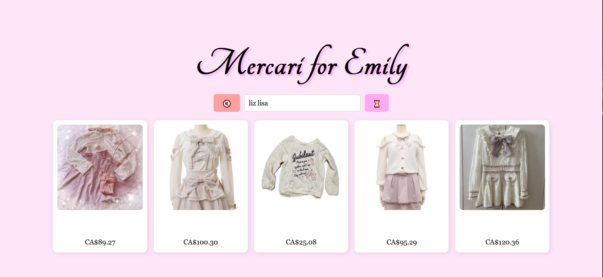

# Overview

My girlfriend complained to me about scalpers buying out all the nice clothes on Mercari, so I created this web app to beat out those scalpers.

# How it works

This web app uses flask. The frontend will provide a simple passcode login before bring you to the root page, where a search bar is provided. Once you submit a query, the scraper search it on https://jp.mercari.com and collect the 5 most recent items every 60 seconds and update the page.

# Requirements

This web app was developed on Windows 10 with Google Chrome and associated drivers installed. If you run this on a different OS, please make sure the python script paths are correct. Besides that, please make sure python and the `requirements.txt` is installed.

# How to run

1. Create a `.env` in the root and add the line `PASSWORD=yourpassword123`
2. Run `app.py` with python or flask
3. Enjoy!